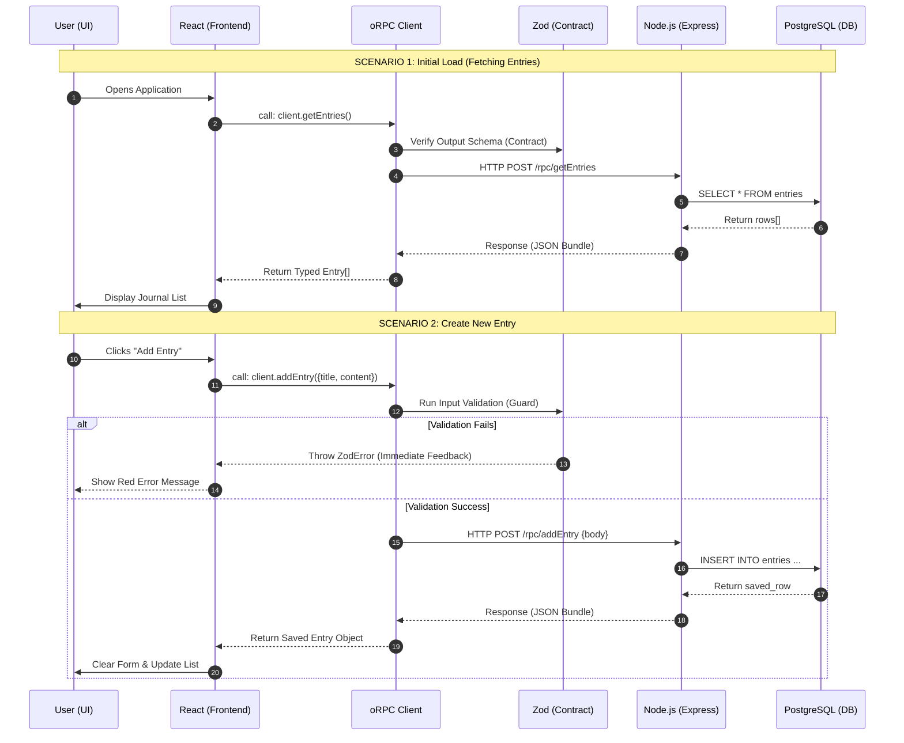

# 📖 Journal App: oRPC Masterclass

A full-stack, end-to-end type-safe journal application built using **React**, **Node.js (Express)**, **oRPC**, **Zod**, and **PostgreSQL**.

---

## 🎨 Application Architecture & User Flow

This diagram illustrates the lifecycle of a request, from the moment a user interacts with the UI to the final database persistency.



---

## 🚀 Technical Stack breakdown

| Technology | Layer | Purpose |
| :--- | :--- | :--- |
| **React** | Frontend (UI) | Handles the view, state, and user interactions. |
| **oRPC** | Networking | Replaces REST. Provides the "Phone Line" between UI and Server. |
| **Zod** | Security/Logic | Acts as the "Guard." Validates inputs and outputs at runtime. |
| **Node.js/Express** | Backend | The "Host" that runs the API and connects to the database. |
| **PostgreSQL** | Database | Permanent storage for your thoughts and memories. |
| **TypeScript** | Everywhere | The "Map." Ensures code quality during development. |

---

## 🛠️ Setup & Running

### 1. Prerequisites
- Node.js installed.
- PostgreSQL running locally or via a URL.

### 2. Backend Setup
```bash
cd server
npm install
# Create a .env file with DATABASE_URL=your_postgres_link
npm run dev
```

### 3. Frontend Setup
```bash
cd my-react-app
npm install
npm run dev
```

---

## 📝 Features
- ✅ **End-to-End Type Safety**: Change one file, update the whole app.
- ✅ **Runtime Validation**: Malformed data is blocked before it hits the DB.
- ✅ **Centralized Contract**: One source of truth for your entire API.
- ✅ **Real-time Persistence**: Data stays safe in PostgreSQL.
