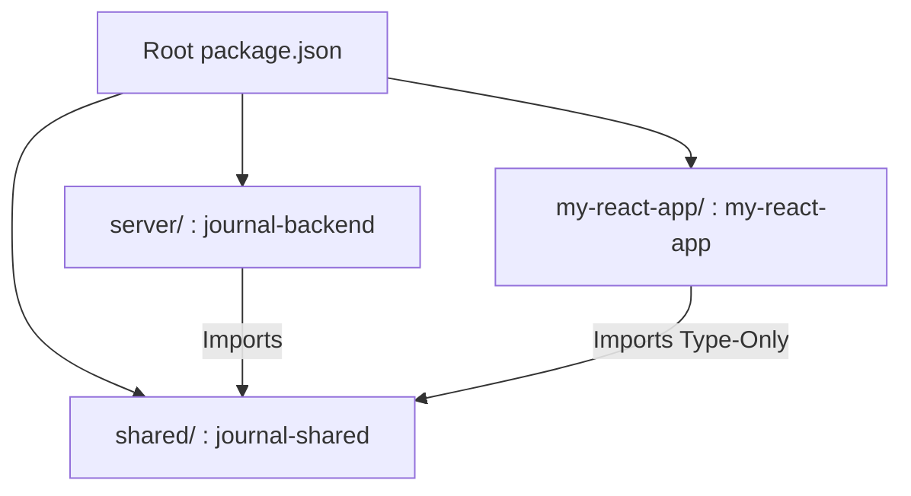
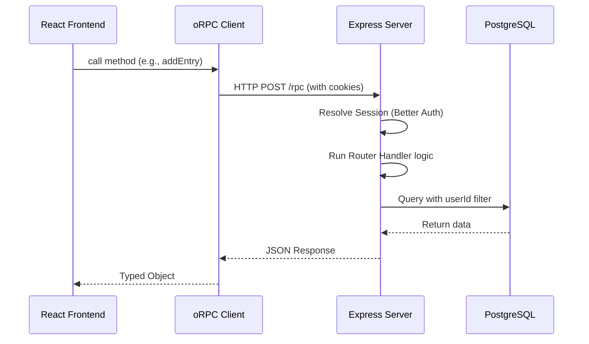

# 📖 JournalApp Technical Documentation

Welcome to the comprehensive technical documentation for JournalApp. This guide provides an in-depth look at the architecture, design patterns, and implementation details of the repository.

---

## 1. Monorepo Architecture

JournalApp is structured as an **npm workspaces** monorepo. This allows multiple packages to reside within a single repository, sharing dependencies and enabling seamless local cross-referencing.

### 1.1 Workspace Declaration
The repository root defines three distinct workspaces in the root `package.json`:

1.  **`shared`** (`journal-shared`): The single source of truth for the API contract and data schemas.
2.  **`server`** (`journal-backend`): The Express-based Node.js backend.
3.  **`my-react-app`** (`my-react-app`): The React/Vite/TypeScript frontend.

### 1.2 Monorepo Topology


### 1.3 How Workspaces are Linked
npm hoists shared dependencies to the root `node_modules/` and creates symlinks for internal workspaces. This means the `server` and `my-react-app` can import from `journal-shared` as if it were a standard npm package, without using relative paths (e.g., `import { ... } from 'journal-shared'`).

---

## 2. Technology Stack

### 2.1 shared/ (journal-shared)
- **@orpc/contract**: Defines the RPC procedures and validation rules.
- **Zod**: Runtime schema validation for inputs and outputs.

### 2.2 server/ (journal-backend)
- **Express**: The core HTTP server framework.
- **Better Auth**: Handles authentication sessions and social login (Google OAuth).
- **Orchid ORM**: Type-safe database interaction.
- **pg**: PostgreSQL driver.
- **Sentry/node & Profiling**: Error tracking and performance monitoring.
- **tsx**: Modern TypeScript execution engine for development and production.

### 2.3 my-react-app/ (Frontend)
- **React 19 & Vite**: Modern UI library and blazing fast build tool.
- **@orpc/client**: Consumes the shared contract to provide a fully typed client.
- **Better Auth Client**: Frontend SDK for authentication management.
- **React Hook Form**: Handles form state and validation.
- **Sentry/react**: Frontend error tracking.

---

## 3. Contract-First API Design

The central design principle is that **`journal-shared` is the source of truth**.

1.  **The Contract**: Defined in `shared/contract.ts`, it specifies exactly which procedures exist (`getEntries`, `addEntry`, etc.), what their arguments are, and what they return.
2.  **The Implementation**: In `server/router.ts`, oRPC's `implement(contract)` ensures that the backend logic strictly follows the contract.
3.  **The Consumption**: The frontend uses `createORPCClient<AppRouter>` to generate a client that matches the contract perfectly. 

> [!TIP]
> This pattern eliminates "out-of-sync" errors between frontend and backend. If you change a field in the contract, both the server and the client will show TypeScript errors immediately.

---

## 4. Backend Deep Dive

### 4.1 Internal Module Map
The backend is modularized to separate concerns:
- **`server.ts`**: The entry point. Handles middleware (Sentry, CORS, Auth) and starts the server.
- **`router.ts`**: Contains the oRPC handler implementations.
- **`auth.ts`**: Configures Better Auth with providers and database adapters.
- **`db/`**: Contains the Orchid ORM configuration and schema definitions.

### 4.2 Startup Sequence
1.  **Sentry Initialization**: Must run first to instrument all subsequent modules.
2.  **Environment Loading**: `dotenv.config()` loads secrets.
3.  **Database Connection**: Orchid ORM connects to PostgreSQL.
4.  **Auth Configuration**: Better Auth is initialized with the database instance.
5.  **Middleware Setup**: CORS, JSON parsing, and Auth middleware.
6.  **RPC Handling**: oRPC handlers are mounted to `/rpc`.

---

## 5. API Router & Security

### 5.1 Context Injection
Every RPC handler receives a `context` object containing:
- `db`: The Orchid ORM instance.
- `user`: The authenticated user object (or `null`).
- `session`: The current session details.

### 5.2 Authorization Pattern & Row-Level Security
We follow a strict security-first approach:
1.  **Authentication Guard**: Every handler first checks `if (!context.user) throw new Error('Unauthorized')`.
2.  **Row Ownership**: Database queries always include a `userId` filter.
    ```typescript
    // Example from updateEntry
    context.db.entry.where({ id, userId: context.user.id }).update(updateData)
    ```
This ensures a user can never access or modify another user's data, regardless of the entry IDs they provide.

---

## 6. Request Lifecycle Summary



---

## 7. Environment Variables Reference

### 7.1 Server-Side variables (`server/.env`)
| Variable | Description | Default |
| :--- | :--- | :--- |
| `DATABASE_URL` | PostgreSQL connection string. | (Required) |
| `BETTER_AUTH_SECRET` | 32+ char random string for session signing. | (Required) |
| `BETTER_AUTH_URL` | Public URL of the backend (for redirects). | `http://localhost:3001` |
| `GOOGLE_CLIENT_ID` | OAuth Client ID from Google Console. | (Optional) |
| `GOOGLE_CLIENT_SECRET` | OAuth Client Secret from Google Console. | (Optional) |
| `ALLOWED_ORIGIN` | Additional CORS allowed origin for production. | (Optional) |
| `PORT` | The port the server listens on. | `3001` |

### 7.2 Client-Side variables (`my-react-app/.env`)
| Variable | Description | Default/Value |
| :--- | :--- | :--- |
| `VITE_API_URL` | URL where the backend is reachable. | `http://localhost:3001` |
| `VITE_APP_URL` | Public URL of the frontend. | `http://localhost:5173` |

---

## 8. Development Workflow

- **Install All**: `npm run install:all` (from root)
- **Start Backend**: `npm run dev:server`
- **Start Frontend**: `npm run dev:client`
- **Database Config**: `cd server && npm run db`
